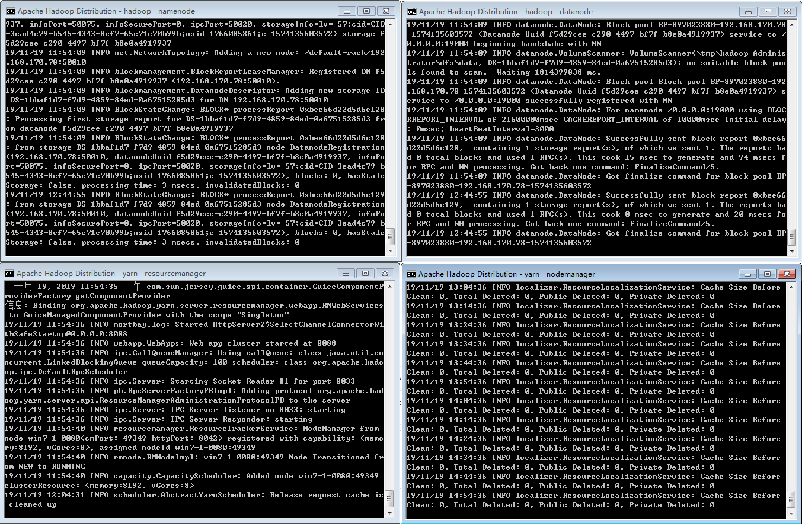

# Hadoop
Hadoop2.8.3在Win7上的单节点安装。

## 步骤
 - 在[https://archive.apache.org/dist/hadoop/common/](https://archive.apache.org/dist/hadoop/common/)下载需要的版本。
 - 配置环境变量HADOOP_HOME为本地Hadoop的安装路径，路径中不能含有空格，参考[https://zh.wikipedia.org/wiki/8.3%E6%96%87%E4%BB%B6%E5%90%8D](https://zh.wikipedia.org/wiki/8.3%E6%96%87%E4%BB%B6%E5%90%8D)进行修改。
 - 按照文档更改或创建```%HADOOP_HOME%/etc/hadoop```下的文件。
 - 在[https://github.com/steveloughran/winutils](https://github.com/steveloughran/winutils)上找到本地Hadoop相应版本的内容，将bin文件夹下的内容复制并替换本地```%HADOOP_HOME%/bin```下的内容。
 - 依次执行命令行。
 
## 命令行
 - ```%HADOOP_HOME%/bin/hdfs namenode -format```    默认在C盘创建tmp文件夹作为Hadoop的文件系统。
 - ```%HADOOP_HOME%/sbin/start-dfs```               启动NameNode和DataNode的守护进程
 - ```%HADOOP_HOME%/sbin/start-yarn```              启动YARN的资源管理器和节点管理器守护进程
 
## 启动结果


## 参考文档
 * [https://cwiki.apache.org/confluence/display/HADOOP2/Hadoop2OnWindows#app-switcher](https://cwiki.apache.org/confluence/display/HADOOP2/Hadoop2OnWindows#app-switcher)